# Privacy-Preserving Identity Verification System - Backend Documentation

## Overview

The Privacy-Preserving Identity Verification System backend is a comprehensive solution that enables secure and privacy-focused identity verification. The system leverages modern technologies and approaches including biometric verification, blockchain-based record-keeping, homomorphic encryption, and GDPR compliance tools to provide a secure yet privacy-preserving identity verification service.

## Key Features

- **Biometric Verification**: Facial recognition and document verification capabilities
- **Blockchain Integration**: Immutable record-keeping for verification results
- **Homomorphic Encryption**: Allows computations on encrypted data without decryption
- **GDPR Compliance**: Built-in tools for managing consent, data subject requests, and data retention
- **Zero-Knowledge Proofs**: Verify identity claims without exposing underlying data
- **Fraud Detection**: AI-powered fraud detection and risk analysis

## Technology Stack

The backend system is built using the following technologies:

- **Framework**: FastAPI (Python 3.9+)
- **Database**: MongoDB for blockchain data persistence
- **Blockchain**: Ethereum-compatible blockchain (or simulated blockchain for development)
- **Encryption**: Homomorphic encryption, format-preserving encryption, and standard encryption
- **Authentication**: JWT-based authentication (for API access)
- **Containerization**: Docker and Docker Compose

## Architecture Overview

```mermaid
graph TD
    Client[Client Applications] --> API[FastAPI Application]
    
    subgraph "API Layer"
        API --> VR[Verification Router]
        API --> PR[Privacy Router]
        API --> ER[Encryption Router]
    end
    
    subgraph "Service Layer"
        VR --> BS[Blockchain Service]
        VR --> BioS[Biometric Service]
        VR --> FDS[Fraud Detection Service]
        
        PR --> ES[Encryption Service]
        PR --> HES[Homomorphic Encryption Service]
        PR --> GDPR[GDPR Compliance Service]
        
        ER --> ES
    end
    
    subgraph "Storage Layer"
        BS --> MongoDB[(MongoDB)]
        BS --> BC[Blockchain]
    end
    
    style API fill:#f9f,stroke:#333,stroke-width:2px
    style Client fill:#bbf,stroke:#333,stroke-width:2px
    style MongoDB fill:#bfb,stroke:#333,stroke-width:2px
    style BC fill:#fbb,stroke:#333,stroke-width:2px
```



## System Components

### API Layer

The API layer is implemented using FastAPI and consists of three main routers:

1. **Verification Router** (`/verification`): Handles biometric and document verification requests
2. **Privacy Router** (`/privacy`): Manages privacy-related operations such as consent and GDPR requests
3. **Encryption Router** (`/encryption`): Provides encryption and decryption services


### Service Layer

The service layer contains the business logic for the application:

#### Blockchain Service

Manages verification status, data access permissions, and storage of verification records on the blockchain.


#### Biometric Service

Handles facial recognition and document verification processes.


#### Encryption Service

Provides various encryption methods including standard encryption, homomorphic encryption, and format-preserving encryption.


#### GDPR Compliance Service

Manages GDPR-related operations such as consent management, data subject requests, and data retention policies.


### Storage Layer

The system uses MongoDB for persistent storage of blockchain data and a simulated blockchain for development purposes.


## API Endpoints

The system provides the following key API endpoints:

### Verification Endpoints

```mermaid
graph LR
    Client --> V1[POST /verification/face]
    Client --> V2[POST /verification/document]
    Client --> V3[GET /verification/status/{verification_type}]
    Client --> V4[POST /verification/grant-access]
    Client --> V5[POST /verification/revoke-access/{third_party_id}]
    Client --> V6[POST /verification/zkp-verify]
    Client --> V7[GET /verification/history]
    Client --> V8[GET /verification/risk-analysis]
    Client --> V9[GET /verification/audit]
    Client --> V10[GET /verification/access-grants]
    
    style Client fill:#bbf,stroke:#333,stroke-width:2px
```

### Privacy Endpoints

```mermaid
graph LR
    Client --> P1[POST /privacy/encrypt]
    Client --> P2[POST /privacy/compute]
    Client --> P3[POST /privacy/decrypt]
    Client --> P4[POST /privacy/encrypt-value]
    Client --> P5[POST /privacy/encrypt-bulk]
    Client --> P6[POST /privacy/privacy-computation]
    Client --> P7[POST /privacy/encrypt-user-data]
    Client --> P8[POST /privacy/data-mask]
    Client --> P9[GET /privacy/gdpr-compliance]
    Client --> P10[POST /privacy/gdpr-request]
    Client --> P11[POST /privacy/consent]
    Client --> P12[DELETE /privacy/consent/{consent_id}]
    Client --> P13[GET /privacy/consent]
    Client --> P14[POST /privacy/dsr]
    Client --> P15[GET /privacy/logs]
    Client --> P16[GET /privacy/report]
    
    style Client fill:#bbf,stroke:#333,stroke-width:2px
```

### Encryption Endpoints


## Verification Flow

The system uses a comprehensive verification flow to ensure identity verification while maintaining privacy:


## Data Access Control Flow

The system implements a secure data access control mechanism:


## Zero-Knowledge Proof Verification

The system supports zero-knowledge proof verification:


## GDPR Compliance Flow

The system includes a comprehensive GDPR compliance mechanism:


## Homomorphic Encryption

The system provides privacy-preserving computations using homomorphic encryption:


## Security Measures

The system implements several security measures:

1. **Encryption**: All sensitive data is encrypted using appropriate encryption methods
2. **Key Rotation**: Encryption keys are rotated regularly to minimize the impact of key compromise
3. **Audit Logging**: All data access is logged for audit purposes
4. **Access Control**: Fine-grained access control mechanisms for data access
5. **Data Minimization**: Only necessary data is collected and processed
6. **Secure Storage**: Data is stored securely with proper access controls

## Deployment

The system can be deployed using Docker Compose:


## System Requirements

- **Python**: 3.9 or higher
- **RAM**: 4GB minimum (8GB recommended)
- **Storage**: 10GB minimum
- **CPU**: 2 cores minimum (4 cores recommended)
- **Network**: Internet connection required for blockchain operations

## Conclusion

The Privacy-Preserving Identity Verification System backend provides a comprehensive solution for secure and privacy-preserving identity verification. By leveraging blockchain technology, homomorphic encryption, and GDPR compliance tools, the system ensures that user privacy is maintained while providing robust identity verification capabilities. 