# Privacy-Preserving Identity Verification System - Blockchain Documentation

## Overview

The blockchain component of the Privacy-Preserving Identity Verification System provides an immutable and transparent layer for storing verification results, managing access permissions, and enabling zero-knowledge proof verifications. By leveraging blockchain technology, the system ensures data integrity while maintaining user privacy and control over personal information.

## Key Features

- **Immutable Verification Records**: Securely stores verification statuses on blockchain
- **Decentralized Access Control**: Grants and revokes third-party access to user data
- **Zero-Knowledge Proof Integration**: Records ZKP verifications without exposing personal data
- **Smart Contract Architecture**: Automates verification and permission logic
- **Privacy-Preserving Design**: Stores only hashes and verification metadata on-chain

## Technology Stack

The blockchain component is built using the following technologies:

- **Smart Contract Language**: Solidity 0.8.0
- **Blockchain Platform**: Ethereum-compatible networks
- **Deployment Tools**: Python with Web3.py
- **Compiler**: Solidity Compiler (solcx)
- **Development Environment**: Ganache (for local testing)
- **Integration**: FastAPI backend integration via Web3.py

## Architecture Overview

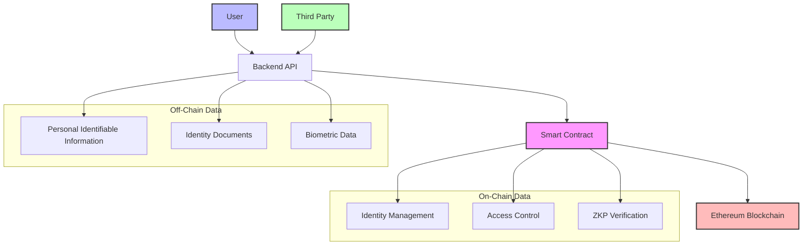

## Smart Contract Design

The system is built around the `IdentityVerification` smart contract, which manages identity verification records, access control, and zero-knowledge proof verifications.

### Contract Structure

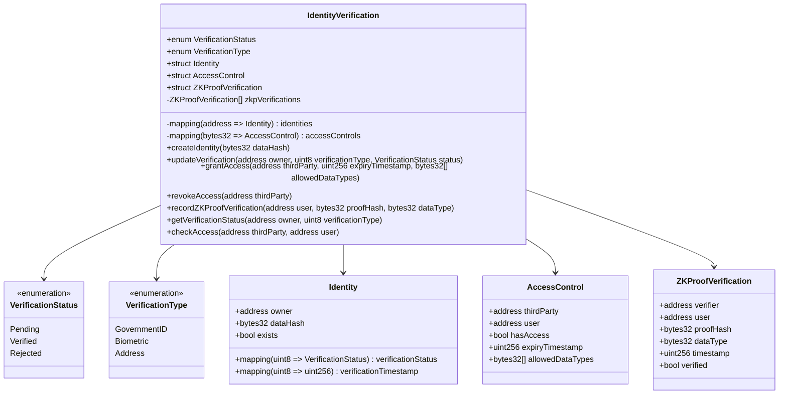

### Data Structures

The smart contract defines several key data structures:

1. **Identity**: Represents a user's identity on the blockchain, containing verification status for different verification types
2. **AccessControl**: Manages access permissions for third parties to user data
3. **ZKProofVerification**: Records instances of zero-knowledge proofs being verified

### Events

The contract emits events to notify clients of important state changes:

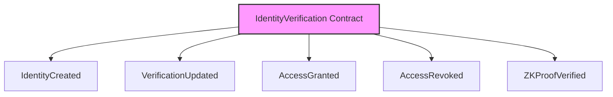

## Key Functions

### Identity Management

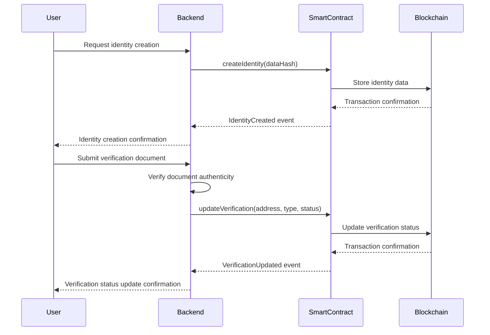

### Access Control

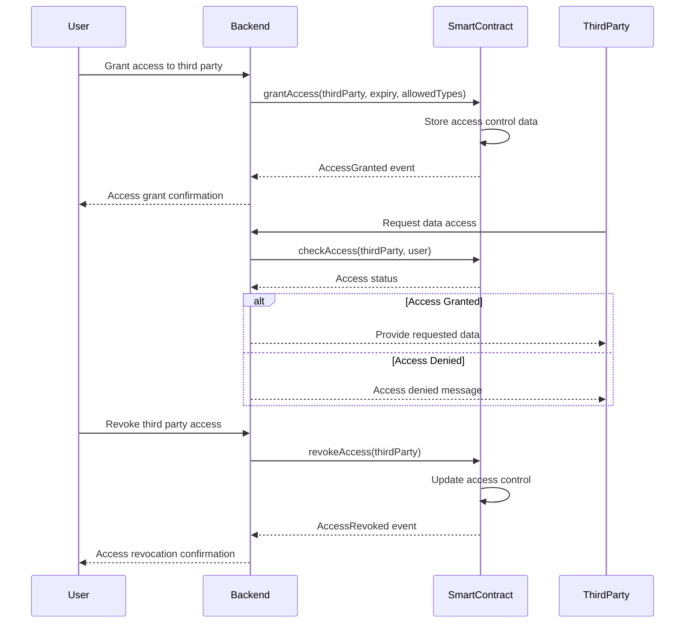

### Zero-Knowledge Proof Verification

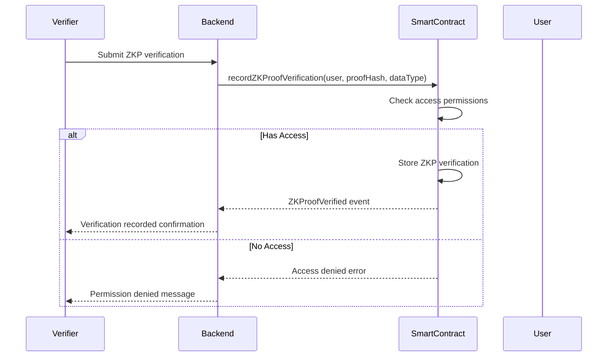

## Deployment Process

The blockchain component includes a deployment script (`deploy_contract.py`) that automates the process of compiling and deploying the smart contract:

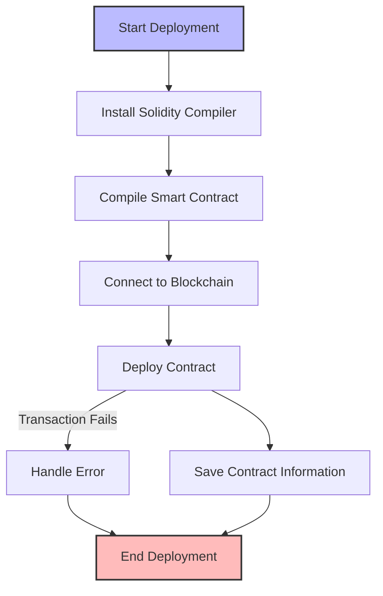

## Integration with Backend

The blockchain component integrates with the backend system through the `blockchain_service.py` module, which provides an interface for interacting with the smart contract:

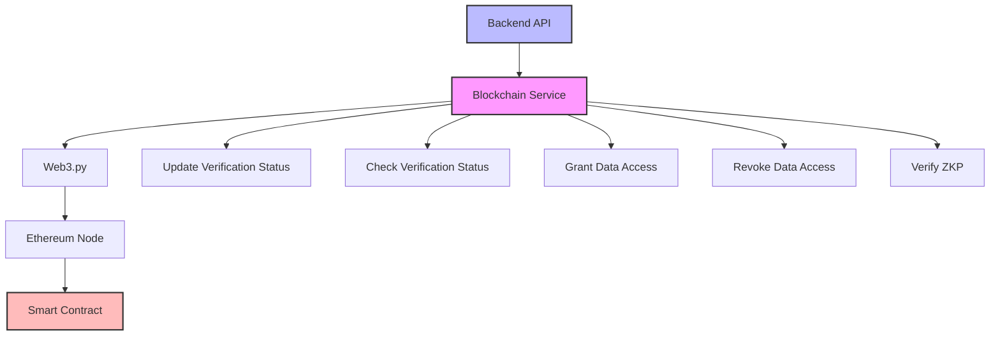

## Privacy Considerations

The blockchain component is designed with privacy in mind:

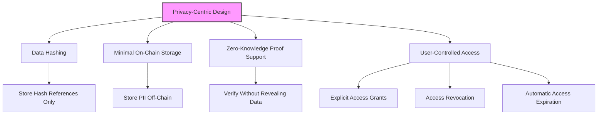

## Transaction Flow

The system's transaction flow for the verification process:

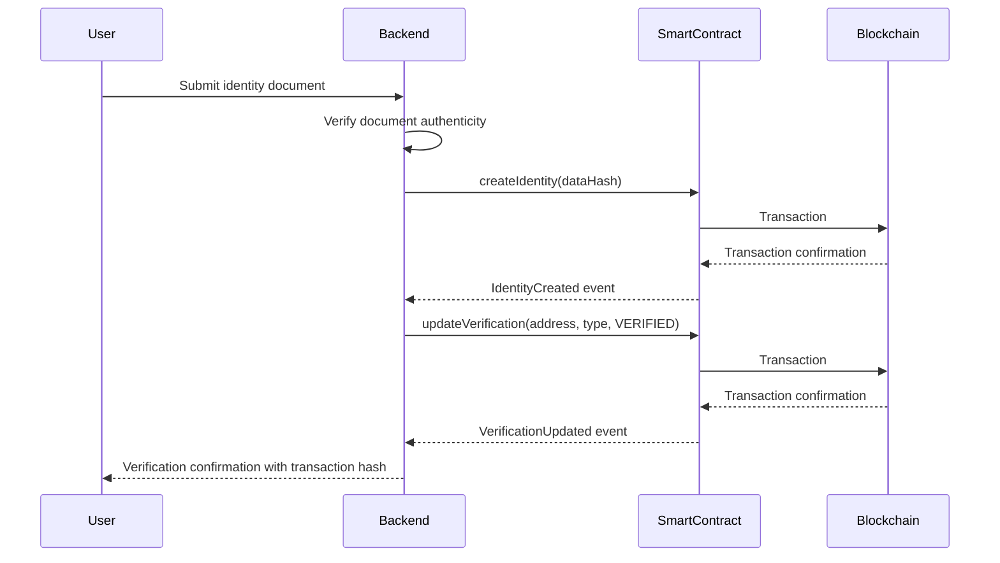

## Security Measures

The blockchain component incorporates several security measures:

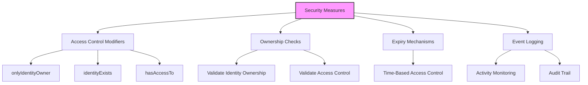

## Code Structure

The blockchain component is organized as follows:

```
blockchain/
│
├── contracts/                  # Smart contracts
│   └── IdentityVerification.sol  # Main identity verification contract
│
└── scripts/                    # Deployment and interaction scripts
    └── deploy_contract.py        # Script to compile and deploy the contract
```

## Gas Optimization

The smart contract implements several gas optimization techniques:

1. **Efficient Data Structures**: Using mappings for O(1) lookups
2. **Data Packing**: Efficient storage of related data
3. **Minimal Storage**: Only storing essential data on-chain
4. **Event Logging**: Using events for historical data instead of storage

## Development and Testing

For local development and testing, the system can use Ganache, a personal Ethereum blockchain:

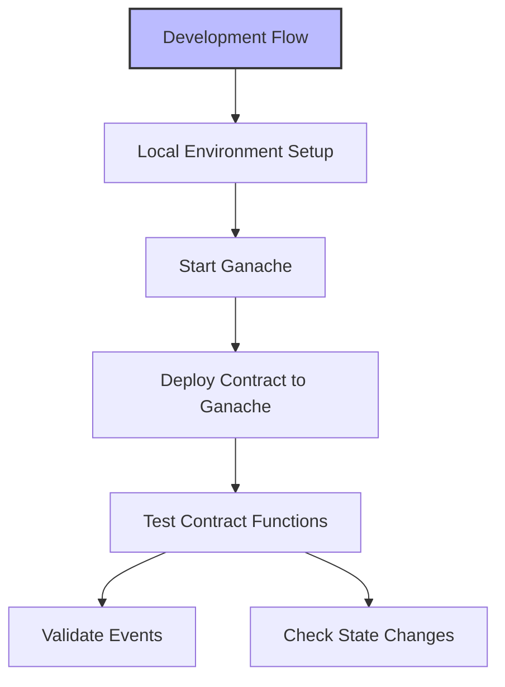

## Recommended Blockchain Configurations

For different deployment environments, the following configurations are recommended:

### Development/Testing
- **Network**: Ganache or local Ethereum network
- **Gas Price**: Low (1-5 Gwei)
- **Compiler Optimization**: Disabled for debugging

### Staging
- **Network**: Ethereum testnet (Goerli, Sepolia)
- **Gas Price**: Medium (based on network conditions)
- **Compiler Optimization**: Enabled (runs: 200)

### Production
- **Network**: Ethereum mainnet or Layer 2 solution
- **Gas Price**: Dynamic (based on network conditions)
- **Compiler Optimization**: Enabled (runs: 200)
- **Security Audit**: Required before deployment

## Future Improvements

Potential future improvements for the blockchain component:

1. **Multi-Chain Support**: Expand to support multiple blockchain networks
2. **Proxy Pattern**: Implement upgradeable contracts using proxy pattern
3. **Decentralized Identity Standards**: Support for DID and Verifiable Credentials
4. **Layer 2 Integration**: Reduce gas costs with Layer 2 scaling solutions
5. **Cross-Chain Verification**: Enable verification across multiple blockchains

## Conclusion

The blockchain component provides a secure, transparent, and privacy-preserving foundation for the identity verification system. By storing only minimal, hashed data on-chain while maintaining cryptographic links to off-chain personal data, the system achieves a balance between transparency, security, and privacy.

The smart contract architecture enables flexible identity verification workflows, fine-grained access control, and zero-knowledge proof integration, creating a comprehensive solution for privacy-focused identity management. 