# Privacy-Preserving Identity Verification System - Frontend Documentation

## Overview

The frontend of the Privacy-Preserving Identity Verification System provides a user-friendly interface for interacting with the privacy-preserving verification features. It offers a secure and intuitive user experience for identity verification, document validation, and privacy management, while interfacing with the blockchain-based backend.

## Key Features

- **Identity Verification**: Facial recognition and document verification interfaces
- **Privacy Dashboard**: Comprehensive overview of user privacy settings and data
- **Homomorphic Encryption Demo**: Interactive demonstration of privacy-preserving data computation
- **GDPR Compliance Tools**: User interfaces for consent management and data subject requests
- **Permission Management**: Control third-party access to verification data
- **Blockchain Integration**: Visualize and interact with blockchain-stored identity data

## Technology Stack

The frontend system is built using the following technologies:

- **Framework**: React.js (18.2.0)
- **UI Component Library**: Material-UI (v4 & v5)
- **Routing**: React Router (v6)
- **API Communication**: Axios
- **State Management**: React Context API
- **Authentication**: Custom Auth Context
- **Blockchain Interaction**: Web3.js and ethers.js libraries
- **Date Handling**: date-fns
- **Containerization**: Docker

## Architecture Overview


## Component Structure

The frontend follows a structured organization of components:


## Page Components

### Home Page

Serves as the landing page and provides an overview of the system's features.


### Verification Page

Handles facial and document verification processes in a step-by-step flow.


### Privacy Dashboard Page

Provides a comprehensive overview of privacy settings and data usage.


### Homomorphic Encryption Page

Demonstrates privacy-preserving computation on encrypted data.


### Permissions Page

Manages third-party access to verification data.


### GDPR Requests Page

Handles GDPR-related user requests and compliance features.


## API Services

The frontend communicates with the backend through various service modules:

```mermaid
classDiagram
    class ApiBase {
        +axios instance
        +API_BASE_URL
        +request interceptors
    }
    
    class AuthService {
        +login(credentials)
        +register(userData)
        +logout()
    }
    
    class IdentityService {
        +verifyFace(userId, faceImage, userData)
        +verifyDocument(userId, documentImage, documentType, userData)
        +getVerificationStatus(userId, verificationType)
        +getVerificationHistory(userId)
        +getRiskAnalysis(userId)
    }
    
    class BlockchainService {
        +getVerificationAudit(userId)
        +generateZkp(userId, thirdPartyId, dataType, proofHash)
    }
    
    class PermissionService {
        +grantAccess(userId, thirdPartyId, dataTypes, expiryDays)
        +revokeAccess(userId, thirdPartyId)
        +getPermissions(userId)
    }
    
    class PrivacyService {
        +encryptValue(value)
        +computeOnEncryptedData(params)
        +decryptValue(encryptedValue)
    }
    
    class EncryptionService {
        +encryptData(userId, data, purpose)
        +decryptData(userId, encryptedData, keyId)
        +computeOnEncrypted(operation, encryptedValues)
    }
    
    class GdprService {
        +recordConsent(userId, purpose, dataCategories, thirdParties)
        +withdrawConsent(userId, consentId)
        +getUserConsents(userId)
        +checkConsent(userId, purpose, dataCategory)
        +submitDSR(userId, requestType, details)
        +getUserRequests(userId)
        +getDataAccessLogs(userId, limit)
        +generatePrivacyReport(userId)
        +anonymizeData(userId, data, sensitiveFields)
        +getRetentionPolicies()
    }
    
    ApiBase <|-- AuthService
    ApiBase <|-- IdentityService
    ApiBase <|-- BlockchainService
    ApiBase <|-- PermissionService
    ApiBase <|-- PrivacyService
    ApiBase <|-- EncryptionService
    ApiBase <|-- GdprService
```



## Context Providers

The application uses React Context API for state management:


## User Flows

### Identity Verification Flow


### Privacy Management Flow


### Homomorphic Encryption Demo Flow


## User Interface

The frontend uses Material-UI components to create a consistent, responsive, and accessible user interface. The design follows a privacy-focused color scheme with indigo as the primary color and green as the secondary color.

### Theme Configuration


## Responsive Design

The frontend is built with responsive design principles to provide an optimal user experience across different devices:


## Deployment

The frontend can be deployed using Docker:


## Code Structure

The codebase follows a modular organization:

```
frontend/
│
├── src/                    # Source files
│   ├── assets/             # Static assets
│   │   ├── Header.js       # Site header
│   │   └── Footer.js       # Site footer
│   │
│   ├── contexts/           # Context providers
│   │   ├── AuthContext.js  # Authentication context
│   │   └── BlockchainContext.js # Blockchain context
│   │
│   ├── pages/              # Page components
│   │   ├── HomePage.js     # Landing page
│   │   ├── VerificationPage.js # Identity verification
│   │   ├── ProfilePage.js  # User profile
│   │   ├── PermissionsPage.js  # Access permissions
│   │   ├── PrivacyDashboardPage.js # Privacy controls
│   │   ├── HomomorphicEncryptionPage.js # Encryption demo
│   │   └── GDPRRequestsPage.js # GDPR compliance
│   │
│   ├── services/           # API services
│   │   └── api.js          # API client configuration
│   │
│   ├── utils/              # Utility functions
│   ├── App.js              # Main App component
│   └── index.js            # Entry point
│
├── public/                 # Public assets
├── package.json            # Dependencies and scripts
└── Dockerfile              # Docker configuration
```

## Key Implementations

### Material-UI Integration

The application uses Material-UI extensively for UI components, ensuring a consistent and professional look and feel.

### Responsive Forms

Form components adapt to different screen sizes while maintaining usability and clear validation feedback.

### Progressive Disclosure

Complex verification processes are broken down into manageable steps using stepper components.

### Real-time Feedback

The UI provides immediate feedback for user actions through snackbar notifications and progress indicators.

### Accessibility

The application follows accessibility best practices including proper contrast ratios, keyboard navigation, and semantic HTML.

## Recommended Screenshot Placement

To enhance the documentation, it is recommended to add screenshots of the application in the following sections:

1. **Homepage Overview** - Add a screenshot of the landing page at the beginning of the document to provide a visual introduction.
2. **Verification Process** - Include screenshots of each step in the verification process in the Verification Page section.
3. **Privacy Dashboard** - Add screenshots of the dashboard tabs in the Privacy Dashboard Page section.
4. **Homomorphic Encryption Demo** - Include screenshots of the encryption demo steps in the Homomorphic Encryption Page section.
5. **GDPR Request Form** - Add a screenshot of the GDPR request form in the GDPR Requests Page section.
6. **Permissions Management** - Include screenshots of the permission control interface in the Permissions Page section.

For each screenshot, use the following format in the markdown file:

```

*Caption explaining the feature shown in the screenshot*
```

## Conclusion

The frontend of the Privacy-Preserving Identity Verification System provides a comprehensive and user-friendly interface for secure identity verification and privacy management. By leveraging modern web technologies and design principles, it delivers a seamless experience while maintaining the highest standards of security and privacy. 